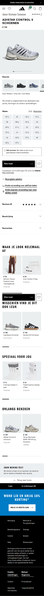

# Procesverslag
Markdown is een simpele manier om HTML te schrijven.  
Markdown cheat cheet: [Hulp bij het schrijven van Markdown](https://github.com/adam-p/markdown-here/wiki/Markdown-Cheatsheet).

Nb. De standaardstructuur en de spartaanse opmaak van de README.md zijn helemaal prima. Het gaat om de inhoud van je procesverslag. Besteedt de tijd voor pracht en praal aan je website.

Nb. Door *open* toe te voegen aan een *details* element kun je deze standaard open zetten. Fijn om dat steeds voor de relevante stuk(ken) te doen.

## Jij

  
uitwerken voor kick-off werkgroep

  ### Auteur:
  Israe Agarouassay 

  #### Je startniveau:
  Blauw 

  #### Je focus:
  Ik ga me tijdens dit vak focussen op de surface plane.

## Je website

  
uitwerken voor kick-off werkgroep

  ### Je opdracht:
  link naar de website die je gaat namaken óf de naam/omschrijving van je eigen ontwerp
  https://www.adidas.nl/

  #### Screenshot(s) van de eerste pagina (small screen): 
  Adidas home pagina 
  

  #### Screenshot(s) van de tweede pagina (small screen):
  Adidas product pagina  
  
 

## Toegankelijkheidstest 1/2 (week 1)

  
uitwerken na test in 2e werkgroep

  ### Bevindingen Screanreader
  Lijst met je bevindingen die tijdens screenreader naar voren kwamen:

Home pagina
- Alles word twee keer benoemd
- Als je op bijvoorbeeld een schoen klikt benoemt die alles wat er staat maar ook veel extra onrelevante informatie zoals: kop niveau 4. Het is onduidelijk wat daarmee word bedoeld.
- De screenreader leest niet alles op pas als je erop klikt en sommige delen helemaal niet zoals kortingen en kopjes zoals: heren, dames en kids.
- De reader Benoemt kopjes eerst door bijvoorbeeld te zeggen: kop niveau 2 en dan de resterende tekst.
- Afbeelding beschrijving zijn grote Deels duidelijk maar er word niet verteld waar je naar toe word geleid als je erop klikt
- Knoppen worden duidelijk benoemd en zijn daarbij toegankelijk.
- Over het algemeen wordt er veel extra informatie benoemd en wordt er maar kort toegelicht waar daadwerkelijk op wordt geklikt.

Product pagina
- Als je op andere kleur (optie schoen) klikt wordt dit niet benoemd en wordt er enkel andere onnodige informatie benoemd.
- Knoppen worden duidelijk benoemd 
- Bij de uitklap vensters word benoemd dat ze worden uitgevouwen enzovoort ,maar niet wat er in staat
- Andere bevindingen komen overeen met de bevindingen op de home pagina.

 ### screenshots tijdens de test: 
  
 
  

  

### Bevindingen WCAG checklist
Lijst met je bevindingen die tijdens WCAG checklist naar voren kwamen:

- Afbeeldingen: alt ontbreekt of is onjuist en decoratieve beelden hebben geen alt=".  Productafbeeldingen hebben geen beschrijvende alt (naam/kleur/model).
- Toetsenbord: focusvolgorde komt niet overeen met de visuele volgorde.
- Lijsten: visueel als lijst, maar niet semantisch weergeven met <ul>/<ol>/<dl>.
- Headings: onduidelijke koppen-structuur.
- errors: er worden meer dan 100+ errors weergeven in W3C validator. Ook veel info's en warnings.

 ### screenshots tijdens de test: 
  
  
  
  
  

## Breakdownschets (week 1)

  
uitwerken na afloop 3e werkgroep

   
  ### de hele pagina: 
  

  ### de tweede pagina: 
  

## Voortgang 1 (week 2)

  
uitwerken voor 1e voortgang

  ### Stand van zaken
  hier dit ging goed & dit was lastig (neem ook screenshots op van delen van je website en code)

  Wat goed ging was het maken van de breakdown schets. Verder ging het coderen van de header moeizaam en is het eigenlijk nog niet gelukt.

  ### foto van wat lastig is: 
  

  ### foto van code van de header: 
  

  ### Agenda voor meeting
  samen met je groepje opstellen

  | student 1      | student 2          | student 3    | student 4        |
  | ---            | ---                | ---          | ---              |
  | dit bespreken  | en dit             | en ik dit    | en dan ik dat    |
  | en dat ook nog | dit als er tijd is | nog een punt | dit wil ik zeker |
  | ...            | ...                | ...          | ...              |

  ### Verslag van meeting
  hier na afloop snel de uitkomsten van de meeting vastleggen

  - Readme is goed ingevuld. Het toevoegen van foto's van de checklist tijdens testen zou het perfect maken.
  - Html goed opgebouw. (hier en daar wat kleine aanpassingen).
  - iconen moeten svg zijn

## Voortgang 2 (week 3)

  
uitwerken voor 2e voortgang

  ### Stand van zaken
  hier dit ging goed & dit was lastig (neem ook screenshots op van delen van je website en code)

- Het stylen van de grid elementen en lijstejes ging me goed af met css. Het duurde wel lang en er waren hier en daar moeilijkheden, maar over het algemeen ging het goed.

- Wat minder goed ging was het plaatsen van tekst op de foto's ik was hier ook heel lang mee bezig en heb veel moeten uitproberen. Het is uiteindelijk wel gelukt. 

- Wat ook minder ging was het stylen van de hamburgermenu. Het nam zoveel tijd in beslag en het lukte maar niet dat ik het voor nu heb gelaten.
  ### Agenda voor meeting
  samen met je groepje opstellen

  | student 1      | student 2          | student 3    | student 4        |
  | ---            | ---                | ---          | ---              |
  | dit bespreken  | en dit             | en ik dit    | en dan ik dat    |
  | en dat ook nog | dit als er tijd is | nog een punt | dit wil ik zeker |
  | ...            | ...                | ...          | ...              |

  ### Verslag van meeting
  hier na afloop snel de uitkomsten van de meeting vastleggen

  - loopt op schema
  - readme hier en daar aanvullen
  - Duidelijk structuur in css

## Toegankelijkheidstest 2/2 (week 4)

  
uitwerken na test in 9e werkgroep

  ### Bevindingen Screanreader
  Lijst met je bevindingen die tijdens screenreader naar voren kwamen (geef ook aan wat er verbeterd is):
:

Home pagina
- 

Product pagina
-
 ### screenshots tijdens de test: 
  
 
  

  

### Bevindingen WCAG checklist
Lijst met je bevindingen die tijdens WCAG checklist naar voren kwamen:

wat is verbeterd:

- tab werkt in een logische volgorde. alleen echte knoppen/links krijgen focus.
- koppen staan netjes: 1 h1 per pagina, daarna h2 en h3 in de juiste volgorde.
- lijsten zijn semantisch: ol/ul/li staan in de code en je ziet dit ook op de pagina.
- afbeeldingen hebben overal een alt. decoratieve beelden zitten in css of hebben alt="".
- animaties houden rekening met prefers-reduced-motion en zijn rustig.
- basiscode is netjes: lang op html, unieke title per pagina.
- html is gevalideerd zonder fouten in de w3c validator.

overige bevindingen 

- icon-knoppen en icon-links hebben een aria-label.
- alle navs hebben een aria label.
- p-tags worden overgeslagen als er met de tab overheen wordt gegaan.

 ### screenshots tijdens de test: 
 - Deze zijn te vinden bij de eerste test

## Voortgang 3 (week 4)

  
uitwerken voor 3e voortgang

  ### Stand van zaken
  hier dit ging goed & dit was lastig (neem ook screenshots op van delen van je website en code)

- wat goed ging was dat het gelukt was met het werkend maken van de hamburgermenu. Het behouden van overzicht in css ging daarbij ook goed.
- Ik begon een beetje aan de surface plane wat me sneller af ging dan het css, maar wanneer iets niet werkte duurde het wel lang voordat ik door had wat er fout ging.
- wat minder goed ging was op het begin dat me homepagina veranderde doordat ik de productpagina ging stylen.
- wat ook moeizaam ging was het sticky maken van de header (of de promobalk of header met svg werd sticky, maar niet allebei) dit kwam onder andere doordat delen van de pagina werden bedekt daardoor.

 ### screenshots: 
  
  
  
  
  

  ### Agenda voor meeting
  samen met je groepje opstellen

  | student 1      | student 2          | student 3    | student 4        |
  | ---            | ---                | ---          | ---              |
  | dit bespreken  | en dit             | en ik dit    | en dan ik dat    |
  | en dat ook nog | dit als er tijd is | nog een punt | dit wil ik zeker |
  | ...            | ...                | ...          | ...              |

  ### Verslag van meeting
  hier na afloop snel de uitkomsten van de meeting vastleggen

  - tips gekregen over welke surface plane onderdelen passen bij mijn site
  - site ziet er erg goed uit en goed op weg
  - readme hier en daar aanvullen

## Eindgesprek (week 5)

  
uitwerken voor eindgesprek

  ### Je uitkomst - karakteristiek screenshots:
  

  ### Dit ging goed/Heb ik geleerd: 
  Korte omschrijving met plaatjes

  

  ### Dit was lastig/Is niet gelukt:
  Korte omschrijving met plaatjes

  

## Bronnenlijst

  
continu bijhouden terwijl je werkt

  Nb. Wees specifiek ('css-tricks' als bron is bijv. niet specifiek genoeg). 
  Nb. ChatGpT en andere AI horen er ook bij.
  Nb. Vermeld de bronnen ook in je code.

  1. https://css-tricks.com/almanac/properties/t/text-indent/
  2. https://css-tricks.com/almanac/properties/w/whitespace/
  3. https://developer.mozilla.org/en-US/docs/Web/CSS/@media/prefers-reduced-motion
  4. https://javascriptf1.com/snippet/detect-escape-key-press-in-javascript
  5. https://pixabay.com/sound-effects/search/finished/

